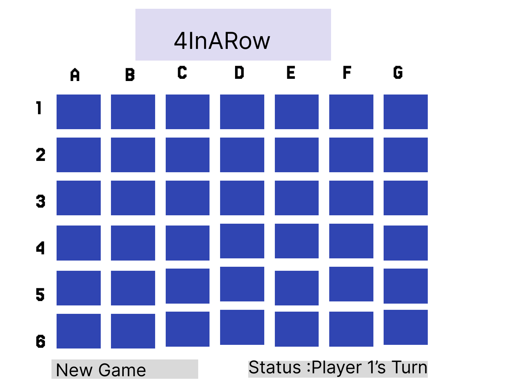

# Title :4 In a Row

**4 in a row** is a fun classic two-player strategy game where the the goal is to be the first to form a line of _four_ of your same colored discs either **vertically, horizontally, or diagonally**.

## Pseudocode

**Board Setup**

- Create 6 rows and 7 columns grid.
- Each cells should be empty before start.

**Handle Logics**

- On clicking a column Find the most bottom empty row in that column.
- Drop the current Player piece into that cell.
- check for this move wins the game or causes the draw.
- if not switch to another player.

**Check for win**

- Check:
- Horizontal 4 in a row
- Vertical 4 in a row
- Diagonal 4 in a row
- if any condition is met:
- Declare winner

**Check for Draw**

- if board is full and no winner.

- Declare "its a draw"

**Switch Player**

- if no win or draw switch to player 2

**Restart Game**

- clear board
- start from player 1

## Wireframe

